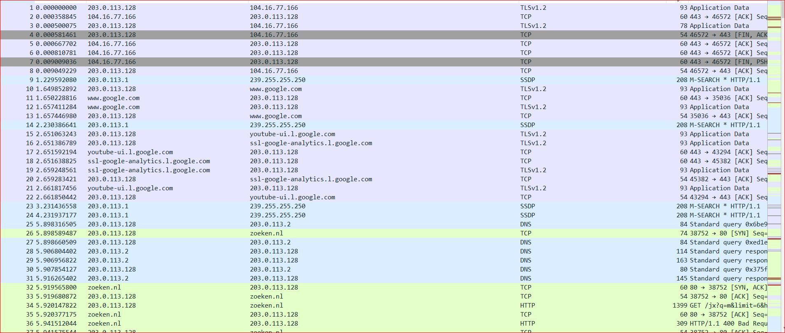
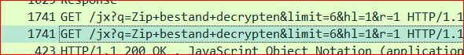
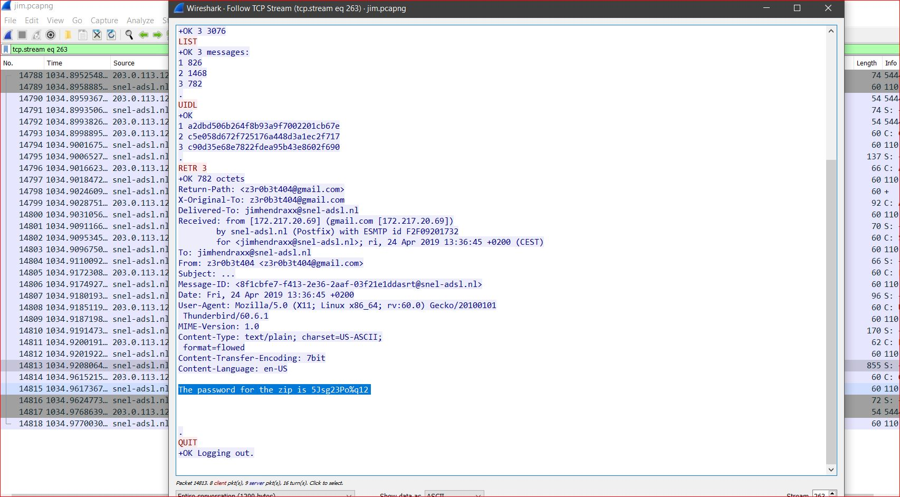
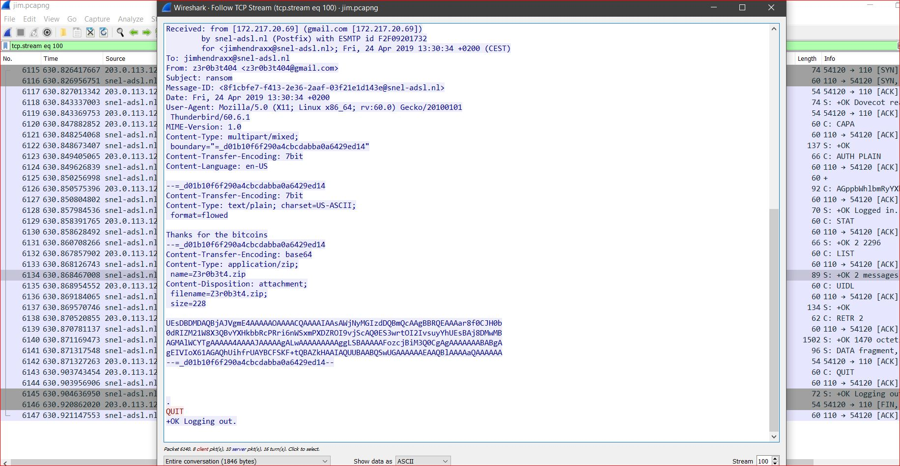

# **Bevat spoilers!** ⚠️ 

 
# TCP/IP Challenge 

**Opdracht:**
In een digitale oplichtingszaak hebben we netwerkverkeer onderschept. Kun jij uitvinden of er malware is verzonden?

<hr>

Bij deze challenge krijg je een pcap bestand. Dit pcap bestand bevat het internetverkeer van onze verdachte.<br> We kunnen het bestand openen in Wireshark.
<br>

Je wordt overspoelt met internetverkeer:
<br>

 

<br>

Tijdens het scrollen kom ik verschillende soorten verkeer tegen, zoals http verkeer naar *zoeken.nl*:
<br><br>
 
<br>
Iets met een zip bestand ontsleutelen...
<br> 

<br>
Even later kom ik **pop** verkeer tegen, waar aan het einde van deze mail conversatie een wachtwoord gegeven is:
<br>
 
<br><br>
Dit doet vermoeden dat er een zip bestand in het spel is, en na verder speuren inderdaad een zip file in een netwerkpakket:
<br><br>
 
<br><br>
We kunnen zien dat deze payload encoded is in base64:
<br>
`Content-Transfer-Encoding: base64`
<br><br><br>
Nu decoden: <br>
```
In: base64 -d decode > zip
In: file zip
Out: zip: Zip archive data, at least v5.1 to extract, compression method=AES Encrypted
```
<br>
Duidelijk een zipfile met een wachwoord.
